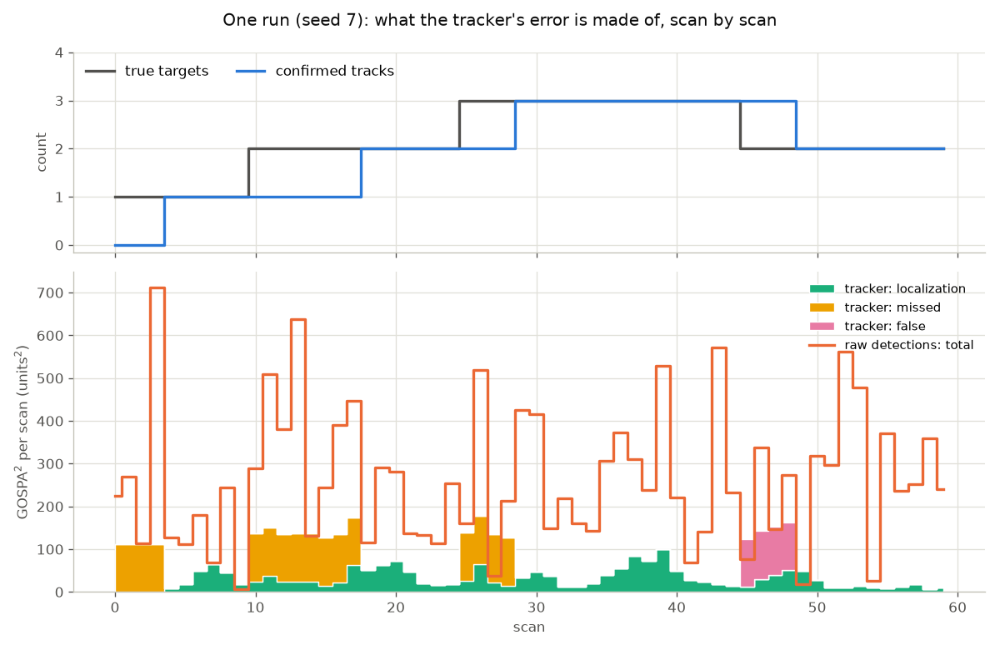
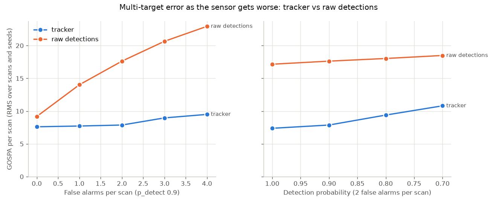
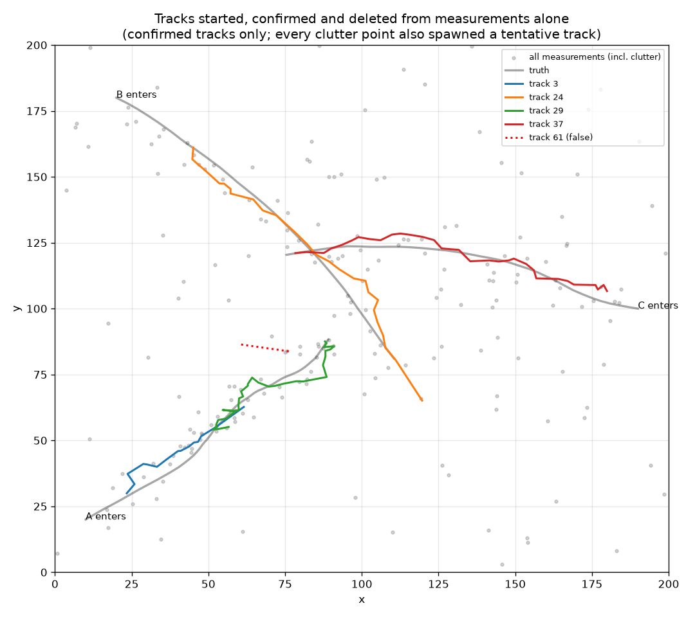

# Multi-Target Tracking Simulator

A modular Python simulation of radar target tracking, state estimation, measurement gating, and multi-target data association.

The system simulates targets moving through space, observes them through a noisy position-only sensor, and reconstructs their trajectories using Kalman filtering. It then extends the single-target tracker to multiple targets using Mahalanobis-distance gating and global nearest-neighbor association solved with the Hungarian algorithm.

The project explores the estimation, tracking, and sensor-fusion problems that arise in real-world radar and autonomous systems.

## Results (Single-Target Tracking)

The baseline experiment runs a target for 60 scans with position measurement noise of σ = 6.0 units per axis.

| Metric | Value |
|---|---|
| Raw measurement RMSE | 8.51 |
| Kalman track RMSE | 4.20 |
| Error reduction vs raw measurements | 50.7% |

The Kalman filter reduces position error by approximately half compared with the raw sensor measurements.


The plot shows:

1. Green: ground-truth target position
2. Red: noisy sensor measurements
3. Blue: Kalman filter estimate

The filter produces a substantially smoother trajectory because it combines noisy measurements with a constant-velocity motion model.

## Results (Multi-Target Tracking)

`python evaluate.py` scores every scan with GOSPA (Rahmathullah, García-Fernández
and Svensson, 2017), comparing the confirmed tracks with the targets actually
present. With α = 2 the score splits into three parts: squared localization
error on matched pairs, and a fixed charge of c²/2 for each missed target and
each false track. The cutoff is c = 15, above typical localization error and
below the spacing between targets. The baseline is the raw detections scored as
if they were the tracker's output, which is the multi-target counterpart of the
raw measurement RMSE above. The scenario is the three-target lifecycle scenario
described below, with 20 seeds per setting and the tracker's thresholds fixed at
confirm_after = 4 and delete_tentative_after = 1.

At p_detect = 0.9 with two false alarms per scan:

| Metric | Raw detections | Tracker |
|---|---|---|
| GOSPA per scan (RMS) | 17.63 | 7.87 |
| Localization RMSE, matched pairs | 5.63 | 3.49 |
| Missed targets per scan | 0.19 | 0.23 |
| False tracks per scan | 2.01 | 0.11 |
| ID changes per run | — | 0.00 |

The tracker lowers GOSPA by 55%. The gain comes from suppressing clutter (2.01
false reports per scan reduced to 0.11) and from filtering noise (localization
error 5.63 reduced to 3.49). The tracker misses slightly more targets than the
raw detections do. Its misses fall almost entirely in the scans before a
target's first confirmation: once confirmed, a track coasts through missed
detections. Its false tracks at this clutter level are mostly the scans a
confirmed track spends coasting after its target has left, before it is deleted.
The timeline below shows both effects in one run.



GOSPA scores each scan on its own and cannot see track identity; a tracker that
swapped IDs every scan could still score well. ID changes are therefore reported
separately, and they stay at or below 0.15 per run in every setting below.

### How performance degrades



| p_detect | False alarms per scan | GOSPA, raw | GOSPA, tracker | Scans to confirm |
|---|---|---|---|---|
| 0.9 | 0 | 9.18 | 7.61 | 4.53 |
| 0.9 | 1 | 14.02 | 7.72 | 4.50 |
| 0.9 | 2 | 17.63 | 7.87 | 4.70 |
| 0.9 | 3 | 20.66 | 8.96 | 5.85 |
| 0.9 | 4 | 22.94 | 9.50 | 6.49 |
| 1.0 | 2 | 17.16 | 7.38 | 3.85 |
| 0.8 | 2 | 18.03 | 9.39 | 8.86 |
| 0.7 | 2 | 18.49 | 10.81 | 12.47 |

The tracker tolerates clutter well. From no clutter to four false alarms per
scan its GOSPA rises by 25%, while the raw detections' rises by a factor of 2.5.
Even with no clutter the tracker scores better, because its localization gain
outweighs the scans it spends confirming each target.

It is more sensitive to missed detections. From p_detect 1.0 to 0.7 its GOSPA
rises by 46%, against 8% for the raw detections. The cause is the confirmation
rule rather than the filter: a tentative track is deleted on its first miss, so
confirmation needs four consecutive detections, which at p_detect 0.7 happens
with probability 0.24. Mean confirmation delay grows from 3.85 scans to 12.47.
The thresholds were chosen at p_detect 0.9 and do not carry over to a weaker
sensor.

## Run it

```bash
pip install -r requirements.txt
python main.py          # single-target demo, prints RMSE, writes tracking_result.png
python gating_demo.py   # per-scan gate: what a track accepts and rejects
python crossing_demo.py # two crossing targets, writes crossing_result.png
python lifecycle_demo.py # targets come and go under clutter, writes lifecycle_result.png
python evaluate.py      # GOSPA sweeps vs the raw-detection baseline, writes evaluation_*.png
pytest                  # the full test suite
```

## Design

```
targets.py       ground-truth target motion (constant-velocity model)
sensor.py        noisy radar: measurement noise, missed detections, clutter
kalman.py        constant-velocity Kalman filter (state [x, vx, y, vy])
track.py         one track: a filter plus its ID, status and hit/miss counts
gating.py        Mahalanobis distance from a prediction to candidate measurements
association.py   global nearest neighbor: which measurement belongs to which track
tracker.py       track lifecycle: initiation, confirmation, deletion
metrics.py       RMSE and GOSPA scoring vs ground truth
scenario.py      the three-target scenario and truth-based track scoring
main.py          single-target end-to-end demo
gating_demo.py   per-scan printout of what the gate accepts and rejects
crossing_demo.py two crossing targets, tracked through the crossing
lifecycle_demo.py targets entering and leaving under clutter, plus a threshold sweep
evaluate.py      GOSPA against the raw-detection baseline, across sensor settings
test_kalman.py   known-answer test on the filter + a noise sanity check
test_track.py    equivalence test: a track matches the bare filter
test_gating.py   hand-computed distances, including a correlated covariance
test_association.py  the case where taking each track's nearest gets it wrong
test_sensor.py   detect() reproduces measure() exactly when nothing is missed
test_tracker.py  each lifecycle rule pinned to the scan it fires on
test_metrics.py  GOSPA cases worked by hand, including one the cutoff decides
```

The sensor reports position only; velocity is never measured. The filter infers
it from the position history — visible in the plot as the estimate settling onto
the true heading after the first few scans.

### Key parameters

- `meas_var` — sensor noise variance; should match the real sensor.
- `process_var` — how much target maneuvering the filter expects. Low values
  smooth hard but lag on turns; high values react fast but track noise. Tuning
  this tradeoff is the core of getting good filter behavior.

## Status & roadmap

All five phases of [ROADMAP.md](ROADMAP.md) are done: the filter runs inside a
`Track`, each track can say which measurements are plausible for it, multiple
tracks are assigned their measurements together rather than one at a time,
tracks are started, confirmed and deleted from the measurements alone under
missed detections and clutter, and the result is scored with GOSPA against a
raw-detection baseline. The extended Kalman filter is the next stretch goal.

## Multi-target: two crossing targets

`python crossing_demo.py` runs two targets onto converging paths that pass within
5 units of each other, with the measurements shuffled each scan so their order
carries no clue about which target produced them.

| Metric | Track 1 | Track 2 |
|---|---|---|
| RMSE vs its own target | 3.04 | 2.61 |
| RMSE vs the other target | 29.14 | 28.24 |

Both tracks finish on the target they started on. On 10 of 29 scans every
measurement fell inside every track's gate, so gating admitted both pairings and
the assignment alone kept the identities apart.


What separates the tracks at the crossing is not position, which is nearly
identical, but velocity: each filter has spent the approach inferring its
target's heading, so the predictions differ even where the positions do not.

Association is global nearest neighbor — the pairing with the lowest total cost
across all tracks, solved exactly with the Hungarian algorithm. Taking each
track's nearest measurement in turn is cheaper and gets contested cases wrong;
`test_association.py` pins a case where it costs three times as much. The known
limitation of this approach is that it commits to one hard assignment per scan,
so a confident wrong choice cannot be revisited, where a probabilistic tracker
would carry the ambiguity forward.

## Track lifecycle: targets that come and go

`python lifecycle_demo.py` runs three targets through a 200 × 200 region at
different times. The sensor reports each target with probability 0.9 per scan
and adds two false alarms per scan on average, scattered uniformly. No track is
seeded by hand. Every measurement that no track claims starts a tentative track;
a tentative track is confirmed after a set number of hits and deleted on its
first miss; a confirmed track is deleted after five misses in a row.
Association runs confirmed tracks first, and tentative tracks compete only for
the measurements left over.

In the seeded run, 76 tracks are created. Three are confirmed, one per target,
and each follows its target for as long as the target is present; B's track is
deleted five scans after B leaves. The other 73 are never confirmed, and every
one that ended within the run was deleted within three scans. B also shows the
cost of deleting tentative tracks on their first miss: the sensor missed B on
scans 11 and 14, each miss removed the tentative track B had started, and B was
confirmed only at scan 18, eight scans after it entered.



One run cannot show a tradeoff, so the demo also sweeps the two thresholds over
20 seeds:

| confirm_after | delete_tentative_after | False tracks per run | Extra tracks on real targets per run | Scans to confirm (mean, max) |
|---|---|---|---|---|
| 3 | 1 | 2.45 | 0.00 | 3.20, 10 |
| 3 | 2 | 6.60 | 0.10 | 3.48, 11 |
| 4 | 1 | 0.15 | 0.00 | 4.70, 11 |
| 4 | 2 | 0.50 | 0.00 | 4.60, 12 |

An extra track on a real target means the target changed track ID during the
run.

The number of hits required to confirm is the setting that controls false
tracks: moving from three to four cuts them by a factor of about sixteen, at a
cost of roughly one and a half scans of delay. Letting a tentative track survive
one miss was expected to reduce restarts on real targets. At this detection
probability it shortens mean confirmation delay by at most 0.1 scans and lengthens
it at three hits, and it roughly triples the false tracks, because clutter-seeded
tracks live long enough to find more clutter.

Giving confirmed tracks first claim on measurements was added after the demo
showed the problem it solves. With all tracks competing equally, a clutter
point pulled target A's track slightly off course at scan 17, a tentative track
started from A's own measurement won the next one, and A changed track ID. Across
the 20 seeds, equal competition left between 0.45 and 0.90 extra tracks per run
on real targets; confirmed-first leaves at most 0.10. It also reduces false
tracks by between a third and two thirds, depending on the thresholds. The
equal-competition figures are from the Phase 4 tracker (commit 2c57d47), scored
with the same sweep and the same seeds.

One limitation is known. A new track's velocity prior, inherited from the
single-target filter, is wide (a standard deviation of about 22 units per scan
against target speeds between 3 and 4), so a new track's gate is large on its
second scan and readily catches clutter.

## Deliberately not built yet

The crossing demo still seeds its two tracks by hand, deliberately, so that it
tests association with no lifecycle logic involved. The velocity prior is left
unchanged because the single-target baseline depends on it, and in the sweep it
mattered less than the confirmation threshold.

Confirmation needs consecutive hits, which the evaluation shows is the tracker's
weak point against a sensor that misses often. An M-of-N rule, such as three
hits in any five scans, would not restart on a single miss; it is the natural
next change to the tracker, but it needs a window of history per tentative
track, and nothing in the current results calls for it at p_detect 0.9.

The evaluation scores scans, not trajectories. Trajectory GOSPA (García-Fernández,
Rahmathullah and Svensson, 2020) adds a penalty for track switches and would
fold the separate ID-change count into the metric. The CLEAR MOT metrics (MOTA
and MOTP), common in computer vision, are the other standard choice; GOSPA was
preferred because its parts are additive and each has a direct meaning.
