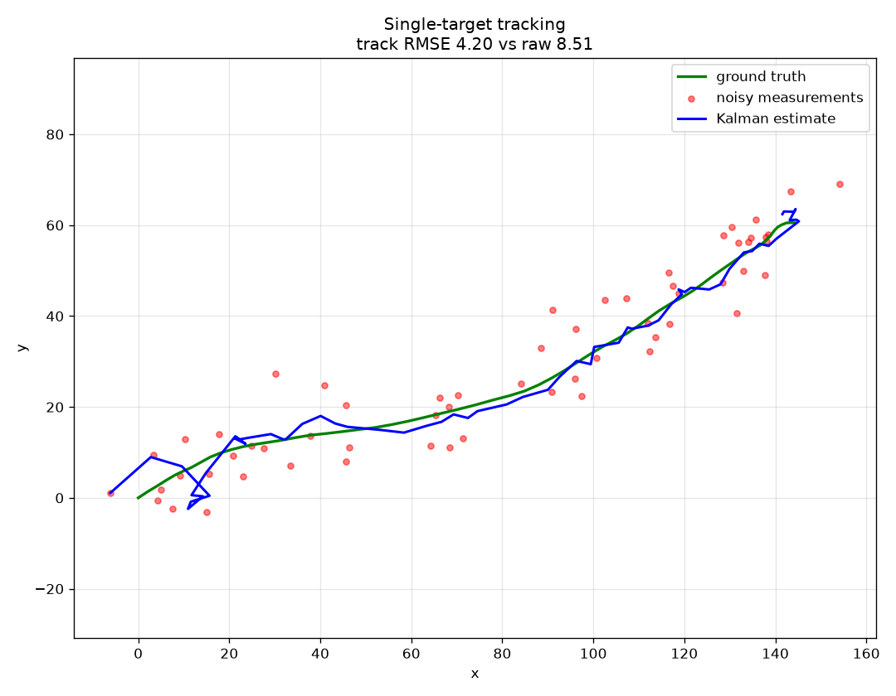

# Multi-Target Tracking Simulator

A modular Python simulation of radar target tracking, state estimation, measurement gating, and multi-target data association.

The system simulates targets moving through space, observes them through a noisy position-only sensor, and reconstructs their trajectories using Kalman filtering. It then extends the single-target tracker to multiple targets using Mahalanobis-distance gating and global nearest-neighbor association solved with the Hungarian algorithm.

The project explores the estimation, tracking, and sensor-fusion problems that arise in real-world radar and autonomous systems.

## Results (Single-Target Tracking)

The baseline experiment runs a target for 60 scans with position measurement noise of σ = 6.0 units per axis.

| Metric | Value |
|---|---|
| Raw measurement RMSE | 8.51 |
| Kalman track RMSE | 4.20 |
| Error reduction vs raw measurements | 50.7% |

The Kalman filter reduces position error by approximately half compared with the raw sensor measurements.



The plot shows:

1. Green: ground-truth target position
2. Red: noisy sensor measurements
3. Blue: Kalman filter estimate

The filter produces a substantially smoother trajectory because it combines noisy measurements with a constant-velocity motion model.

## Run it

```bash
pip install -r requirements.txt
python main.py        # runs the demo, prints RMSE, writes tracking_result.png
python test_kalman.py # runs the tests (or: pytest test_kalman.py)
```

Phase 3 of the roadmap adds a `scipy` dependency for the assignment solver; it
is not needed yet.

## Design

```
targets.py       ground-truth target motion (constant-velocity model)
sensor.py        noisy radar: measurement noise
kalman.py        constant-velocity Kalman filter (state [x, vx, y, vy])
track.py         one track: a filter plus its ID and hit/miss bookkeeping
gating.py        Mahalanobis distance from a prediction to candidate measurements
metrics.py       RMSE scoring vs ground truth
main.py          single-target end-to-end demo
gating_demo.py   per-scan printout of what the gate accepts and rejects
test_kalman.py   known-answer test on the filter + a noise sanity check
test_track.py    equivalence test: a track matches the bare filter
test_gating.py   hand-computed distances, including a correlated covariance
```

The sensor reports position only; velocity is never measured. The filter infers
it from the position history — visible in the plot as the estimate settling onto
the true heading after the first few scans.

### Key parameters

- `meas_var` — sensor noise variance; should match the real sensor.
- `process_var` — how much target maneuvering the filter expects. Low values
  smooth hard but lag on turns; high values react fast but track noise. Tuning
  this tradeoff is the core of getting good filter behavior.

## Status & roadmap

Single-target tracking is complete, tested, and validated. Phases 1 and 2 of
[ROADMAP.md](ROADMAP.md) are done: the filter runs inside a `Track` that carries
an ID and hit/miss counts, and each track can say which measurements are
plausible for it before any assignment is made. Data association is next.

Gating measures distance in units of the filter's own uncertainty rather than in
position units, so the same chi-square threshold means different things at
different times. `python gating_demo.py` shows a gate reaching 72 units on the
first scan, when the track knows almost nothing about its target's velocity, and
23 units once the filter has settled — with the threshold never changing.

Track status and the confirm/delete thresholds are deliberately not implemented
yet. Nothing reads them until Phase 4, which is also where missed detections and
clutter enter the sensor — the conditions those thresholds need to be tuned
against. The decoy measurements in the gating demo are generated by that demo,
not by the sensor, for the same reason.
