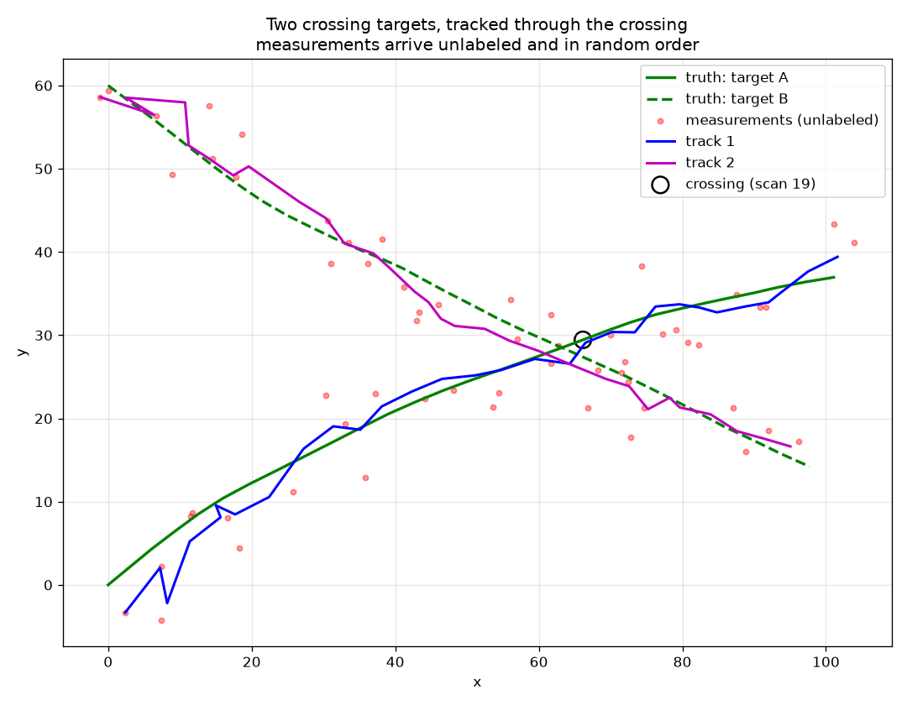

# Multi-Target Tracking Simulator

A modular Python simulation of radar target tracking, state estimation, measurement gating, and multi-target data association.

The system simulates targets moving through space, observes them through a noisy position-only sensor, and reconstructs their trajectories using Kalman filtering. It then extends the single-target tracker to multiple targets using Mahalanobis-distance gating and global nearest-neighbor association solved with the Hungarian algorithm.

The project explores the estimation, tracking, and sensor-fusion problems that arise in real-world radar and autonomous systems.

## Results (Single-Target Tracking)

The baseline experiment runs a target for 60 scans with position measurement noise of σ = 6.0 units per axis.

| Metric | Value |
|---|---|
| Raw measurement RMSE | 8.51 |
| Kalman track RMSE | 4.20 |
| Error reduction vs raw measurements | 50.7% |

The Kalman filter reduces position error by approximately half compared with the raw sensor measurements.


The plot shows:

1. Green: ground-truth target position
2. Red: noisy sensor measurements
3. Blue: Kalman filter estimate

The filter produces a substantially smoother trajectory because it combines noisy measurements with a constant-velocity motion model.

## Run it

```bash
pip install -r requirements.txt
python main.py          # single-target demo, prints RMSE, writes tracking_result.png
python gating_demo.py   # per-scan gate: what a track accepts and rejects
python crossing_demo.py # two crossing targets, writes crossing_result.png
pytest                  # the full test suite
```

## Design

```
targets.py       ground-truth target motion (constant-velocity model)
sensor.py        noisy radar: measurement noise
kalman.py        constant-velocity Kalman filter (state [x, vx, y, vy])
track.py         one track: a filter plus its ID and hit/miss bookkeeping
gating.py        Mahalanobis distance from a prediction to candidate measurements
association.py   global nearest neighbor: which measurement belongs to which track
metrics.py       RMSE scoring vs ground truth
main.py          single-target end-to-end demo
gating_demo.py   per-scan printout of what the gate accepts and rejects
crossing_demo.py two crossing targets, tracked through the crossing
test_kalman.py   known-answer test on the filter + a noise sanity check
test_track.py    equivalence test: a track matches the bare filter
test_gating.py   hand-computed distances, including a correlated covariance
test_association.py  the case where taking each track's nearest gets it wrong
```

The sensor reports position only; velocity is never measured. The filter infers
it from the position history — visible in the plot as the estimate settling onto
the true heading after the first few scans.

### Key parameters

- `meas_var` — sensor noise variance; should match the real sensor.
- `process_var` — how much target maneuvering the filter expects. Low values
  smooth hard but lag on turns; high values react fast but track noise. Tuning
  this tradeoff is the core of getting good filter behavior.

## Status & roadmap

Phases 1 through 3 of [ROADMAP.md](ROADMAP.md) are done: the filter runs inside a
`Track`, each track can say which measurements are plausible for it, and multiple
tracks are assigned their measurements together rather than one at a time. Track
lifecycle is next.

## Multi-target: two crossing targets

`python crossing_demo.py` runs two targets onto converging paths that pass within
5 units of each other, with the measurements shuffled each scan so their order
carries no clue about which target produced them.

| Metric | Track 1 | Track 2 |
|---|---|---|
| RMSE vs its own target | 3.04 | 2.61 |
| RMSE vs the other target | 29.14 | 28.24 |

Both tracks finish on the target they started on. On 10 of 29 scans every
measurement fell inside every track's gate, so gating admitted both pairings and
the assignment alone kept the identities apart.



What separates the tracks at the crossing is not position, which is nearly
identical, but velocity: each filter has spent the approach inferring its
target's heading, so the predictions differ even where the positions do not.

Association is global nearest neighbor — the pairing with the lowest total cost
across all tracks, solved exactly with the Hungarian algorithm. Taking each
track's nearest measurement in turn is cheaper and gets contested cases wrong;
`test_association.py` pins a case where it costs three times as much. The known
limitation of this approach is that it commits to one hard assignment per scan,
so a confident wrong choice cannot be revisited, where a probabilistic tracker
would carry the ambiguity forward.

## Deliberately not built yet

Track status and the confirm/delete thresholds are not implemented. Nothing reads
them until Phase 4, which is also where missed detections and clutter enter the
sensor — the conditions those thresholds need to be tuned against. For the same
reason, both demos generate their own decoy and multi-target setup rather than
adding capability to `sensor.py`, and tracks are still seeded by hand rather than
initiated from unmatched measurements.
